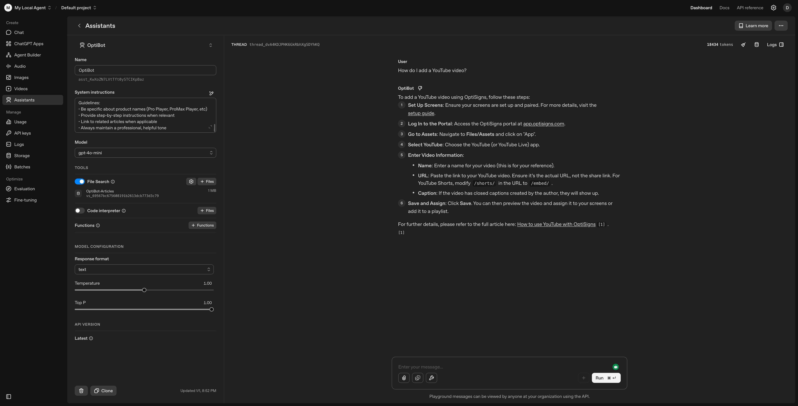

````markdown
# cryptic-repo-name

> Zendesk Help Center scraper → OpenAI vector store uploader. Runs once, exits 0.

## Setup

- Copy env: `cp .env.sample .env` then set `OPENAI_API_KEY=...` (only required key for local).
- Optional Spaces S3: set `SPACES_ENDPOINT, SPACES_REGION, SPACES_BUCKET, SPACES_KEY, SPACES_SECRET` if you want remote state/logs.
- Install deps: `python -m venv .venv && source .venv/bin/activate && pip install -r requirements.txt`.

## Run Locally

- Python: `python -m src.jobs.main` (uses `.env`, writes state/logs to `data/`).
- Docker build: `docker build -t optibot:latest .`
- Docker run (no volume, runs once, exits 0):
  ```bash
  docker run --rm -e OPENAI_API_KEY=$OPENAI_API_KEY optibot:latest
  ```
- With local persistence: `docker run --rm -e OPENAI_API_KEY=$OPENAI_API_KEY -v $(pwd)/data:/app/data optibot:latest`

## Deploy as Daily DigitalOcean Job

- Push image: `docker push registry.digitalocean.com/hometest/optibot:latest`.
- Job command: `python -m src.jobs.main`.
- Set envs in DO: at least `OPENAI_API_KEY`; add `SPACES_*` for remote state/logs.
- Daily log (Spaces CDN): https://hometest.sfo3.cdn.digitaloceanspaces.com/logs/run.log

## Repo Hygiene

- Keep secrets out of git; `.env.sample` lists required keys.
- Repo name is intentionally non-obvious; no hard-coded keys.

## Screenshot



````
